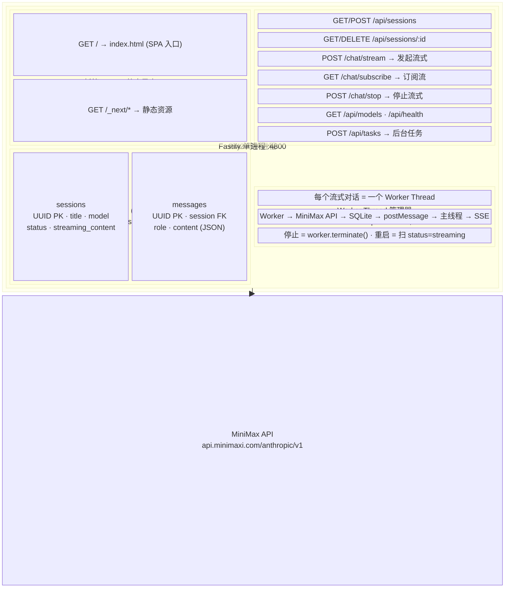
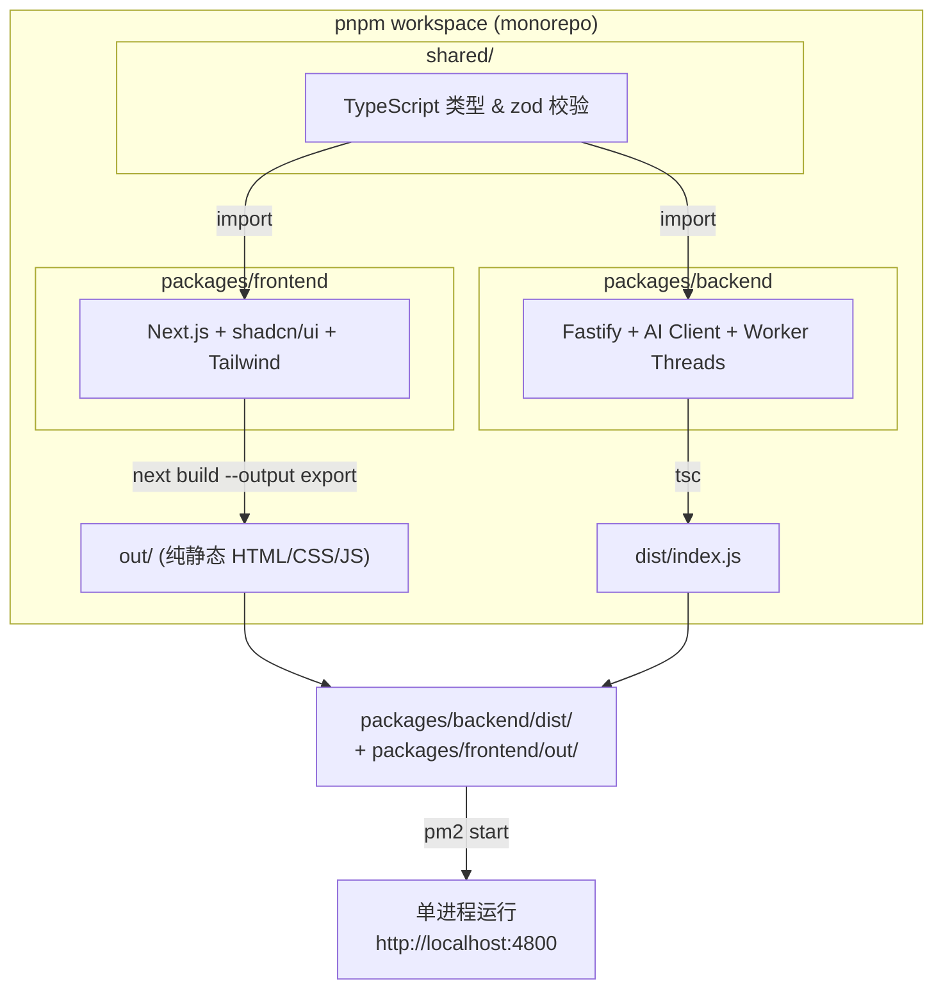
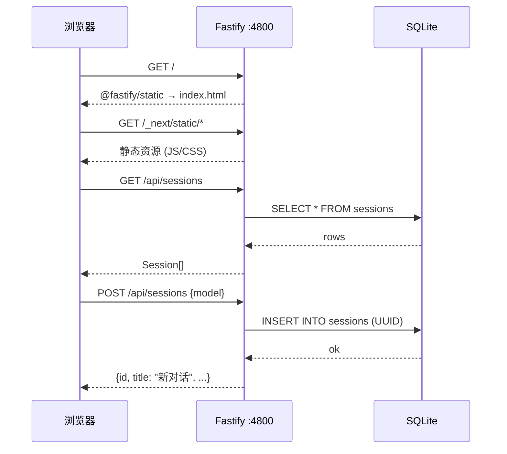
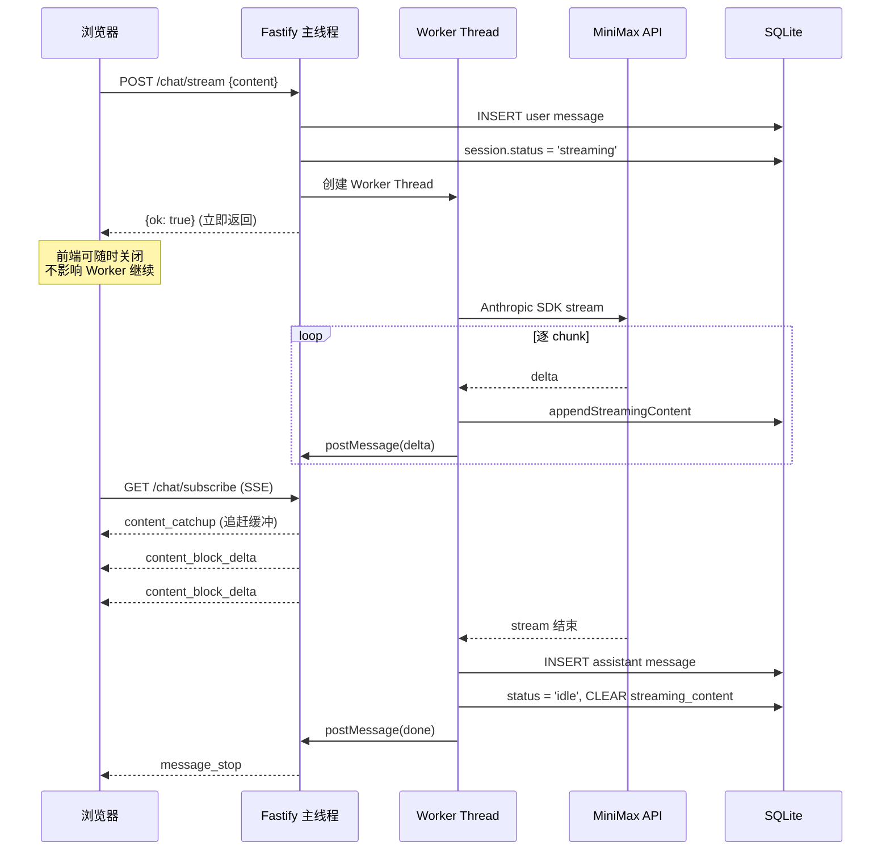
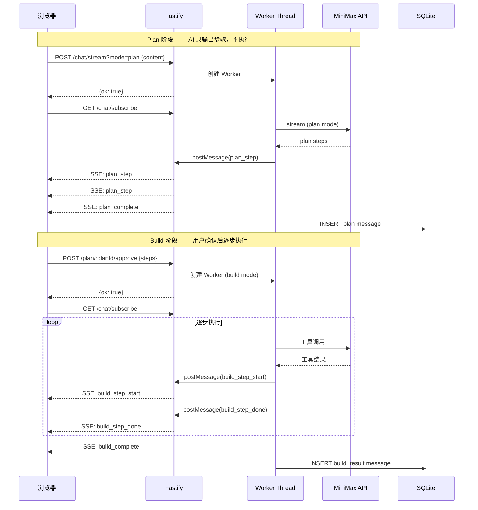
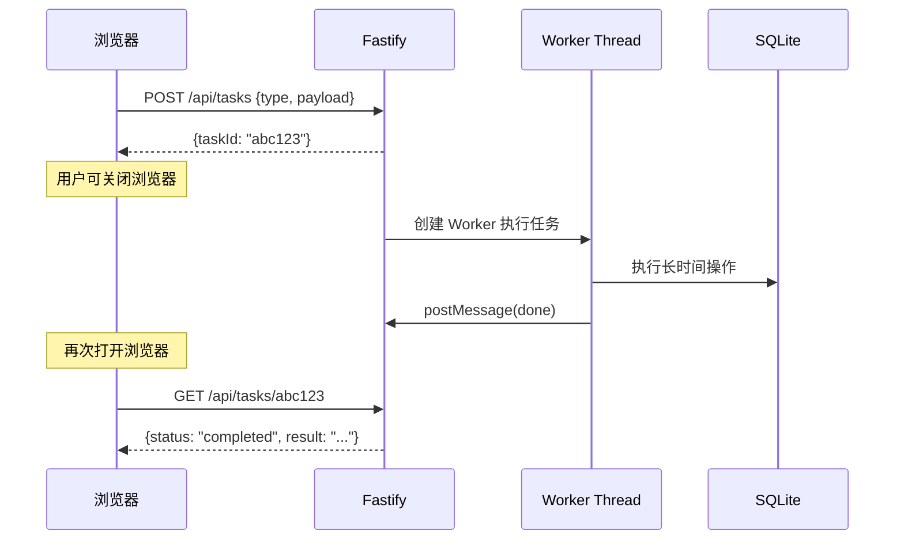

# 2. 系统架构图

## 2.1 单进程一体化架构（核心）



## 2.2 构建流程



## 2.3 数据流

### 2.3.1 页面加载 & 会话管理



### 2.3.2 流式对话（后端独立执行 + 前端订阅）



### 2.3.3 停止对话 & 刷新恢复

```mermaid
sequenceDiagram
  participant B as 浏览器
  participant F as Fastify 主线程
  participant W as Worker Thread
  participant DB as SQLite

  Note over B,W: 停止场景
  B->>F: POST /chat/stop
  F->>W: worker.terminate()
  destroy W
  F->>DB: 保存 partial 为 assistant 消息 (stopped)
  F->>DB: status = 'idle'
  F-->>B: {ok: true, aborted: true}

  Note over B,DB: 刷新/重开恢复场景
  B->>F: GET /api/sessions/:id
  F->>DB: SELECT session + messages
  DB-->>F: {status: 'streaming', streamingContent: '...'}
  F-->>B: session + messages + streamingContent

  B->>F: GET /chat/subscribe (自动重连)
  F-->>B: content_catchup (追赶已缓冲内容)
  F-->>B: content_block_delta (继续实时接收)
```

### 2.3.4 Plan / Build 模式



### 2.3.5 后台任务


